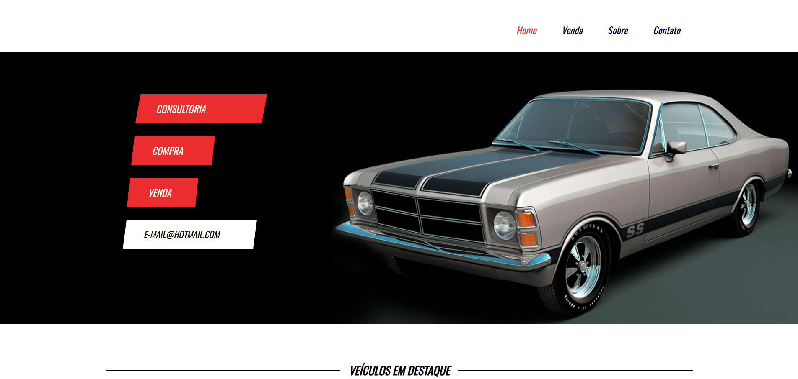

# 🚗 Site de Venda de Carros

Este é um projeto de site fictício para uma loja de venda de carros, criado com HTML e CSS puros. O objetivo é praticar e demonstrar habilidades de front-end, com foco em estrutura, organização e design responsivo.

---

## 📸 Preview

 

---

## 🌐 Funcionalidades

- Página inicial com destaque para a loja
- Seção com lista de veículos disponíveis
- Estilo visual moderno com HTML e CSS
- Layout responsivo para diferentes dispositivos

---

## 🛠️ Tecnologias Utilizadas

- HTML5
- CSS3

---

## 📁 Como usar

1. Clone o repositório:
   ```bash
   git clone https://github.com/seu-usuario/site-venda-carros.git
2.Acesse a pasta do projeto:

bash
3.Copiar
4.Editar
5.cd site-venda-carros

ou

6.Clique no botão verde **"Code"** acima.
7.Selecione **"Download ZIP"** para baixar o projeto.
8.Abra o arquivo index.html.
